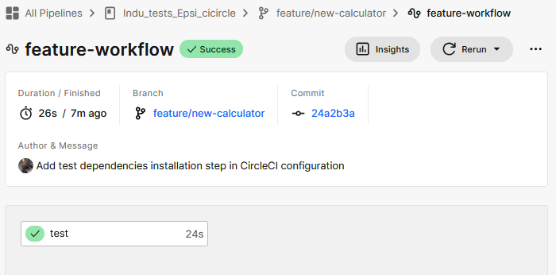
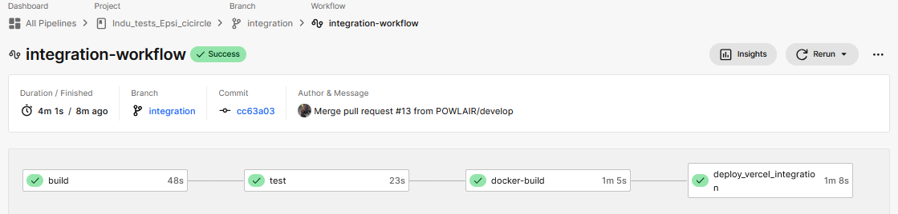
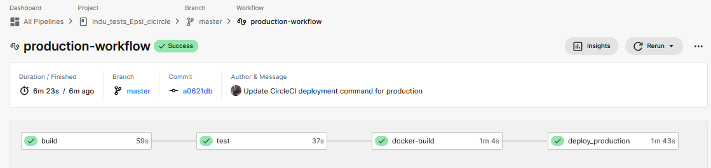
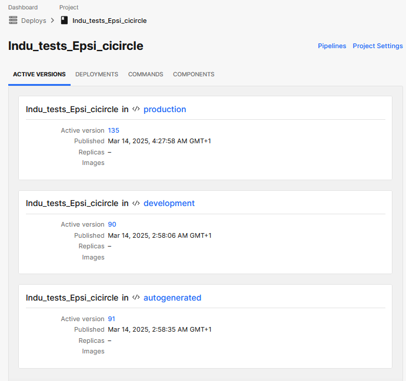
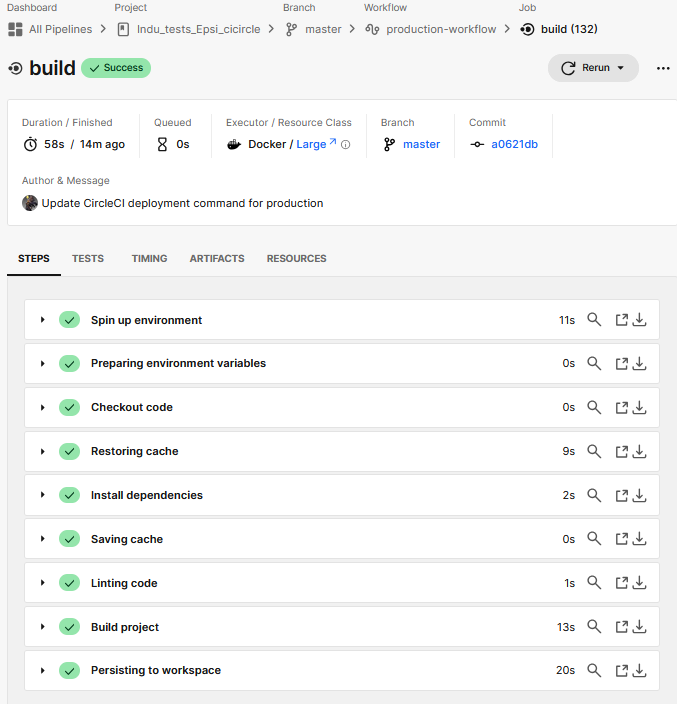
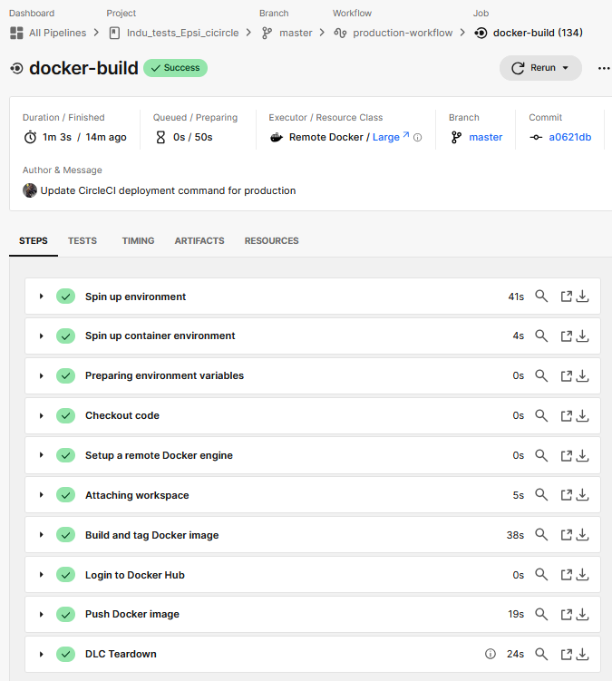
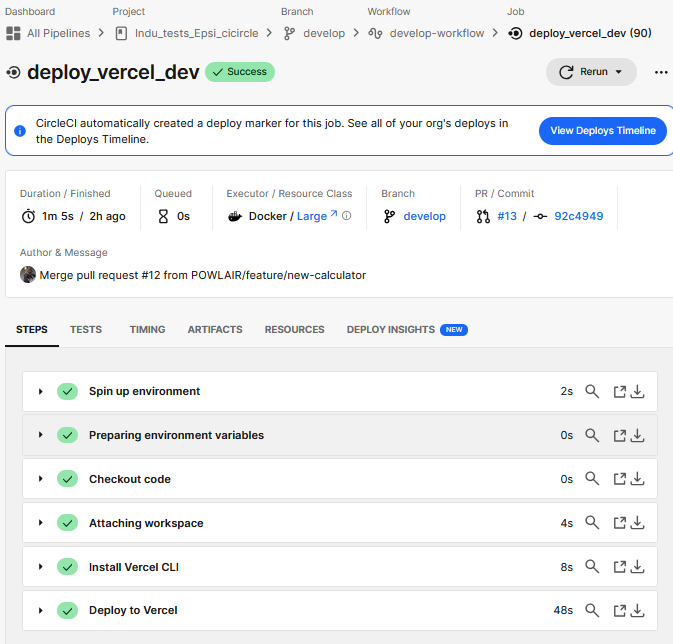
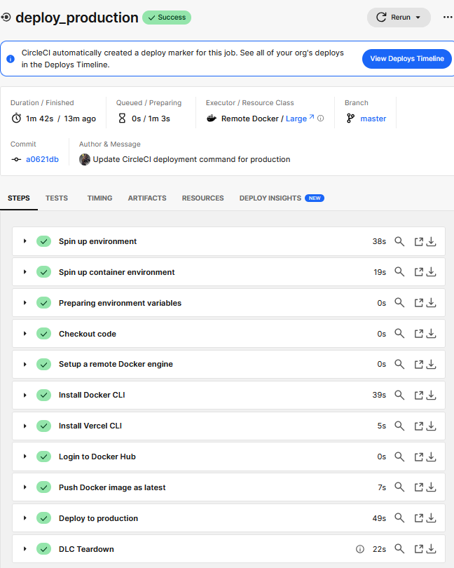

# Documentation Technique - Configuration CircleCI


## Plan du projet

| Section | Description |
|---------|------------|
| [Introduction](#introduction) | Présentation générale du projet et de CircleCI |
| [Documentation des outils](#documentation-des-outils) | Références aux outils utilisés (Vercel, Docker, CircleCI, GitHub) |
| [Structure du Workflow](#structure-du-workflow) | Explication des différents workflows du projet |
| [Workflows](#workflows) | Explication des différents workflows du projet |
| [Details du fichier de configuration CircleCI](#details-du-fichier-de-configuration-circleci) | Détails sur le fichier `.circleci/config.yml` |
| [Executors](#executors) | Explication des exécuteurs utilisés dans CircleCI |
| [Description des Jobs](#description-des-jobs) | Détails des différents jobs exécutés |
| [Job `build`](#job-build) | Installation des dépendances et build du projet |
| [Job `test`](#job-test) | Exécution des tests unitaires et d'intégration |
| [Job `docker-build`](#job-docker-build) | Construction et poussée d'une image Docker |
| [Job `deploy_production`](#job-deploy_production) | Déploiement en production avec Docker et Vercel |
| [Job `deploy_vercel`](#job-deploy_vercel) | Déploiement de l'application sur Vercel |

## Documentation des outils

| Vercel | CircleCI | Docker Hub | GitHub |
|:------:|:--------:|:----------:|:------:|
|  |  |  |  |
| Plateforme de déploiement pour applications web modernes avec CI/CD automatisé | Outil d'intégration et de déploiement continu (CI/CD) | Registre public pour stocker et distribuer des images Docker | Plateforme de gestion de code source basée sur Git |
| [Voir le projet](https://indu-tests-epsi-cicircle.vercel.app/) | [Voir sur GitHub](https://github.com/POWLAIR/Indu_tests_Epsi_cicircle) | [Voir l'image Docker](https://hub.docker.com/repository/docker/powlker/circleci/general) | [Voir le repository](https://github.com/POWLAIR/Indu_tests_Epsi_cicircle) |

## Introduction

Cette documentation décrit en détail le fichier de configuration **CircleCI** utilisé pour automatiser les tests, la construction, l'intégration continue et le déploiement de l'application.

### Objectifs du Pipeline CI/CD

Notre pipeline CI/CD a été conçu pour répondre aux objectifs suivants :
- Automatisation complète du processus de test et de déploiement
- Validation systématique du code avant intégration
- Déploiement continu vers différents environnements
- Gestion des versions Docker
- Séparation claire des environnements de développement, préproduction et production

### Bonnes Pratiques Implémentées

1. **Tests Automatisés**
   - Tests unitaires
   - Tests d'intégration
   - Validation du code (linting)

2. **Gestion du Cache**
   - Mise en cache des dépendances Node.js
   - Cache des couches Docker
   - Optimisation des temps de build

3. **Sécurité**
   - Gestion sécurisée des secrets avec les variables d'environnement CircleCI
   - Authentification sécurisée pour Docker Hub et Vercel
   - Isolation des environnements de déploiement

4. **Gestion des Versions**
   - Tagging automatique des images Docker
   - Versioning des déploiements Vercel
   - Traçabilité des builds

## Structure du Workflow

Notre pipeline CI/CD est organisé en 4 workflows distincts, chacun adapté à une phase spécifique du développement.

### Feature Workflow

**Branche :** `feature/*`  
**Objectif :** Validation rapide du code

#### Étapes :
- Vérification du code
- Exécution des tests
- Génération des rapports



---

### Develop Workflow

**Branche :** `develop`  
**Objectif :** Intégration continue

#### Étapes :
- Build du projet
- Exécution des tests
- Construction Docker
- Déploiement Vercel (dev)


---

### Integration Workflow

**Branche :** `integration`  
**Objectif :** Validation pré-production

#### Étapes :
- Build du projet
- Tests complets
- Construction Docker
- Déploiement Vercel (preprod)



---

### Production Workflow

**Branche :** `main`  
**Objectif :** Déploiement production

#### Étapes :
- Build du projet
- Tests complets
- Construction Docker
- Push Docker latest
- Déploiement production



---

### Version Deployement par environnement



## Details du fichier de configuration CircleCI

### Fichier de Configuration - `.circleci/config.yml`

```yaml
version: 2.1

orbs:
  node: circleci/node@5
  docker: circleci/docker@2

executors:
  node-executor:
    docker:
      - image: node:18-bullseye
    working_directory: ~/project
```

#### Executors
L'exécuteur `node-executor` utilise l'image **Node.js 18-bullseye** et définit le répertoire de travail du projet.

### Description des Jobs

#### Job `build`

Ce job est responsable de l'installation des dépendances, du linting et de la compilation du projet.

```yaml
  build:
    executor: node-executor
    steps:
      - checkout
      - restore_cache:
          keys:
            - v1-dependencies-{{ checksum "package-lock.json" }}
      - run:
          name: "Install dependencies"
          command: npm install
      - save_cache:
          paths:
            - node_modules
          key: v1-dependencies-{{ checksum "package-lock.json" }}
      - run:
          name: "Linting code"
          command: npm run lint
      - run:
          name: "Build project"
          command: npm run build
      - persist_to_workspace:
          root: .
          paths:
            - node_modules
            - .next
            - public
```

Explication :
- Récupère le code source (`checkout`).
- Restaure les dépendances depuis le cache si possible (`restore_cache`).
- Installe les dépendances (`npm install`).
- Sauvegarde le cache (`save_cache`).
- Vérifie la qualité du code (`npm run lint`).
- Compile le projet (`npm run build`).
- Sauvegarde les fichiers générés pour les étapes suivantes (`persist_to_workspace`).



### Job `test`

Ce job exécute les tests unitaires et d'intégration du projet.

```yaml
  test:
    executor: node-executor
    steps:
      - checkout
      - restore_cache:
          keys:
            - v1-dependencies-{{ checksum "package-lock.json" }}
      - attach_workspace:
          at: ~/project
      - run:
          name: "Run tests"
          command: npm run test:ci
```

Explication :
- Récupère le code source (`checkout`).
- Restaure les dépendances (`restore_cache`).
- Attache l'espace de travail contenant les dépendances (`attach_workspace`).
- Exécute les tests (`npm run test:ci`).


### Job `docker-build`

Construit et pousse une image Docker du projet.

```yaml
  docker-build:
    docker:
      - image: docker:stable
    steps:
      - checkout
      - setup_remote_docker:
          docker_layer_caching: true
      - attach_workspace:
          at: ~/project
      - run:
          name: "Build and tag Docker image"
          command: |
            docker build --cache-from powlker/circleci:latest -t powlker/circleci:$CIRCLE_SHA1 .
      - run:
          name: "Login to Docker Hub"
          command: |
            echo "$DOCKER_PASSWORD" | docker login -u "$DOCKER_USERNAME" --password-stdin
      - run:
          name: "Push Docker image"
          command: |
            docker push powlker/circleci:$CIRCLE_SHA1
```

Explication :
- Récupère le code source (`checkout`).
- Attache l'espace de travail contenant les fichiers nécessaires (`attach_workspace`).
- Installe l'outil de déploiement Vercel CLI (`npm install -g vercel`).
- Déploie l'application sur Vercel en utilisant le token d'authentification et le scope correspondant.



### Job `deploy_vercel`

Ce job assure le déploiement de l'application sur **Vercel** pour les environnements de développement et d'intégration.

```yaml
  deploy_vercel:
    executor: node-executor
    parameters:
      vercel_scope:
        type: string
    steps:
      - checkout
      - attach_workspace:
          at: ~/project
      - run:
          name: "Install Vercel CLI"
          command: npm install -g vercel
      - run:
          name: "Deploy to Vercel"
          command: |
            vercel --token $VERCEL_TOKEN --prod --scope << parameters.vercel_scope >>
```
Explication :
- Récupère le code source (`checkout`).
- Attache l'espace de travail contenant les fichiers nécessaires (`attach_workspace`).
- Installe l'outil de déploiement Vercel CLI (`npm install -g vercel`).
- Déploie l'application sur Vercel en utilisant le token d'authentification et le scope correspondant.




### Job `deploy_production`

Ce job assure le déploiement en production en utilisant une image **Node.js 18** avec support des navigateurs, l'installation de Docker CLI, l'installation de Vercel CLI, la gestion des images Docker et le déploiement final sur **Vercel**.

```yaml
  deploy_production:
    docker:
      - image: cimg/node:18.19-browsers  
    steps:
      - checkout
      - setup_remote_docker:
          docker_layer_caching: true
      - run:
          name: "Install Docker CLI"
          command: |
            curl -fsSL https://get.docker.com -o get-docker.sh
            sudo sh get-docker.sh
      - run:
          name: "Install Vercel CLI"
          command: sudo npm install -g vercel
      - run:
          name: "Login to Docker Hub"
          command: |
            echo "$DOCKER_PASSWORD" | docker login -u "$DOCKER_USERNAME" --password-stdin
      - run:
          name: "Push Docker image as latest"
          command: |
            docker pull powlker/circleci:$CIRCLE_SHA1
            docker tag powlker/circleci:$CIRCLE_SHA1 powlker/circleci:latest
            docker push powlker/circleci:latest
      - run:
          name: "Deploy to production"
          command: |
            vercel --token $VERCEL_TOKEN --prod
            echo "Production deployed"
```

### Explication des étapes
- **Utilisation de l'image `cimg/node:18.19-browsers`** : Fournit un environnement avec Node.js 18 et support des navigateurs.
- **Installation de Docker CLI** : Télécharge et installe Docker CLI pour exécuter les commandes Docker dans l'environnement CircleCI.
- **Installation de Vercel CLI** : Installe l'outil CLI de Vercel pour gérer les déploiements.
- **Authentification sur Docker Hub** : Nécessaire pour pousser les images Docker.
- **Mise à jour et push de l'image Docker** : Télécharge l'image Docker existante, la tague en `latest` et la pousse sur Docker Hub.
- **Déploiement sur Vercel** : Effectue le déploiement final de l'application en production.



## Architecture Technique

### Technologies Utilisées

1. **Frontend**
   - Next.js - Framework React pour le rendu côté serveur
   - TypeScript - Typage statique du code
   - Jest - Framework de test

2. **Conteneurisation**
   - Docker - Conteneurisation de l'application
   - Multi-stage builds pour optimisation

3. **CI/CD**
   - CircleCI - Orchestration des pipelines
   - Vercel - Plateforme de déploiement
   - Docker Hub - Registre d'images

### Environnements de Déploiement

| Environnement | Branche | URL | Usage |
|--------------|---------|-----|-------|
| Développement | develop | [Dev URL] | Tests développeurs |
| Préproduction | integration | [Preprod URL] | Tests QA |
| Production | main | [Prod URL] | Environnement live |

### Monitoring et Maintenance

1. **Surveillance**
   - Logs CircleCI pour le suivi des builds
   - Métriques Vercel pour les déploiements
   - Surveillance Docker Hub pour les images

2. **Maintenance**
   - Mises à jour régulières des dépendances
   - Nettoyage périodique des anciennes images Docker
   - Revue des performances des pipelines

## Guide de Contribution

### Prérequis
- Node.js 18 ou supérieur
- Docker Desktop
- Compte GitHub avec accès au repository
- Accès aux plateformes (CircleCI, Vercel, Docker Hub)

### Workflow de Développement
1. Créer une branche feature depuis develop
2. Développer et tester localement
3. Pousser les changements
4. Vérifier le pipeline CircleCI
5. Créer une Pull Request
6. Attendre la validation
7. Merger dans develop

### Commandes Utiles
```bash
# Installation locale
npm install

# Tests
npm run test
npm run test:ci

# Build local
npm run build

# Docker local
docker build -t app-name .
docker run -p 3000:3000 app-name
```

## Résolution des Problèmes Courants

### Erreurs Communes
1. **Échec des Tests**
   - Vérifier les logs CircleCI
   - Exécuter les tests localement
   - Vérifier les dépendances

2. **Échec du Build Docker**
   - Vérifier le Dockerfile
   - Vérifier les permissions Docker Hub
   - Nettoyer le cache Docker local

3. **Échec du Déploiement Vercel**
   - Vérifier les tokens d'authentification
   - Vérifier les logs de déploiement
   - Vérifier la configuration projet

### Contact et Support
Pour toute question ou problème :
- Ouvrir une issue sur GitHub
- Contacter l'équipe DevOps
- Consulter la documentation technique complète


