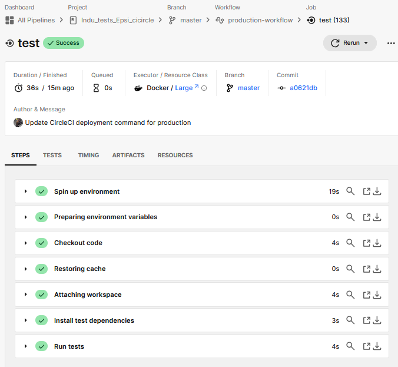
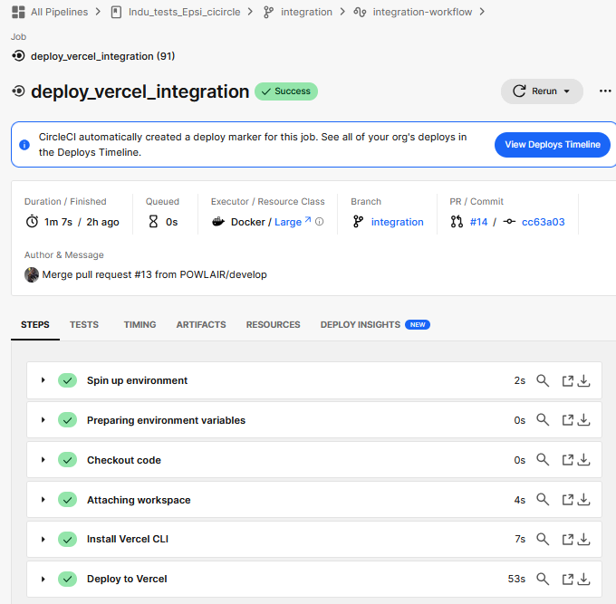

# Documentation Technique - Configuration CircleCI


## Plan du projet

| Section | Description |
|---------|------------|
| [Introduction](#introduction) | Présentation générale du projet et de CircleCI |
| [Structure du Workflow](#structure-du-workflow) | Explication des différents workflows du projet |
| [Fichier de Configuration](#fichier-de-configuration) | Détails sur le fichier `.circleci/config.yml` |
| [Executors](#executors) | Explication des exécuteurs utilisés dans CircleCI |
| [Description des Jobs](#description-des-jobs) | Détails des différents jobs exécutés |
| [Job `build`](#job-build) | Installation des dépendances et build du projet |
| [Job `deploy_production`](#job-deploy_production) | Déploiement en production avec Docker et Vercel |
| [Job `deploy_vercel`](#job-deploy_vercel) | Déploiement de l’application sur Vercel |
| [Documentation des outils](#documentation-des-outils) | Références aux outils utilisés (Vercel, Docker, CircleCI, GitHub) |


## Introduction

Cette documentation décrit en détail le fichier de configuration **CircleCI** utilisé pour automatiser les tests, la construction, l'intégration continue et le déploiement de l'application.


## Structure du Workflow

Ce pipeline est divisé en plusieurs workflows, chacun correspondant à un environnement spécifique :

- **[Feature](#feature-workflow)** : Exécute uniquement les tests sur les branches `feature/*`.
- **[Develop](#develop-workflow)** : Build, test, build Docker et déploiement sur **Vercel (environnement de développement)**.
- **[Integration](#integration-workflow)** : Build, test, build Docker et déploiement sur **Vercel (environnement de préproduction)**.
- **[Production](#production-workflow)** : Build, test, build Docker, push en `latest`, puis déploiement en production.

## Workflows

### Feature Workflow
Exécute uniquement les tests sur les branches `feature/*`.


### Develop Workflow
- Build du projet
- Exécution des tests
- Build Docker
- Déploiement sur Vercel (développement)


### Integration Workflow
- Build du projet
- Exécution des tests
- Build Docker
- Déploiement sur Vercel (préproduction)


### Production Workflow
- Build du projet
- Exécution des tests
- Build Docker
- Push de l’image Docker en `latest`
- Déploiement en production


### Version Deployement par environnement :


## Details du fichier de configuration CircleCI

### Fichier de Configuration - `.circleci/config.yml`

```yaml
version: 2.1

orbs:
  node: circleci/node@5
  docker: circleci/docker@2

executors:
  node-executor:
    docker:
      - image: node:18-bullseye
    working_directory: ~/project
```

#### Executors
L’exécuteur `node-executor` utilise l’image **Node.js 18-bullseye** et définit le répertoire de travail du projet.

### Description des Jobs

#### Job `build`

Ce job est responsable de l’installation des dépendances, du linting et de la compilation du projet.

```yaml
  build:
    executor: node-executor
    steps:
      - checkout
      - restore_cache:
          keys:
            - v1-dependencies-{{ checksum "package-lock.json" }}
      - run:
          name: "Install dependencies"
          command: npm install
      - save_cache:
          paths:
            - node_modules
          key: v1-dependencies-{{ checksum "package-lock.json" }}
      - run:
          name: "Linting code"
          command: npm run lint
      - run:
          name: "Build project"
          command: npm run build
      - persist_to_workspace:
          root: .
          paths:
            - node_modules
            - .next
            - public
```

Explication :
- Récupère le code source (`checkout`).
- Restaure les dépendances depuis le cache si possible (`restore_cache`).
- Installe les dépendances (`npm install`).
- Sauvegarde le cache (`save_cache`).
- Vérifie la qualité du code (`npm run lint`).
- Compile le projet (`npm run build`).
- Sauvegarde les fichiers générés pour les étapes suivantes (`persist_to_workspace`).


### Job `test`

Ce job exécute les tests unitaires et d’intégration du projet.

```yaml
  test:
    executor: node-executor
    steps:
      - checkout
      - restore_cache:
          keys:
            - v1-dependencies-{{ checksum "package-lock.json" }}
      - attach_workspace:
          at: ~/project
      - run:
          name: "Run tests"
          command: npm run test:ci
```

Explication :
- Récupère le code source (`checkout`).
- Restaure les dépendances (`restore_cache`).
- Attache l’espace de travail contenant les dépendances (`attach_workspace`).
- Exécute les tests (`npm run test:ci`).



### Job `docker-build`

Construit et pousse une image Docker du projet.

```yaml
  docker-build:
    docker:
      - image: docker:stable
    steps:
      - checkout
      - setup_remote_docker:
          docker_layer_caching: true
      - attach_workspace:
          at: ~/project
      - run:
          name: "Build and tag Docker image"
          command: |
            docker build --cache-from powlker/circleci:latest -t powlker/circleci:$CIRCLE_SHA1 .
      - run:
          name: "Login to Docker Hub"
          command: |
            echo "$DOCKER_PASSWORD" | docker login -u "$DOCKER_USERNAME" --password-stdin
      - run:
          name: "Push Docker image"
          command: |
            docker push powlker/circleci:$CIRCLE_SHA1
```

Explication :
- Récupère le code source (`checkout`).
- Attache l’espace de travail contenant les fichiers nécessaires (`attach_workspace`).
- Installe l’outil de déploiement Vercel CLI (`npm install -g vercel`).
- Déploie l’application sur Vercel en utilisant le token d’authentification et le scope correspondant.


### Job `deploy_vercel`

Ce job assure le déploiement de l’application sur **Vercel** pour les environnements de développement et d'intégration.

```yaml
  deploy_vercel:
    executor: node-executor
    parameters:
      vercel_scope:
        type: string
    steps:
      - checkout
      - attach_workspace:
          at: ~/project
      - run:
          name: "Install Vercel CLI"
          command: npm install -g vercel
      - run:
          name: "Deploy to Vercel"
          command: |
            vercel --token $VERCEL_TOKEN --prod --scope << parameters.vercel_scope >>
```
Explication :
- Récupère le code source (`checkout`).
- Attache l’espace de travail contenant les fichiers nécessaires (`attach_workspace`).
- Installe l’outil de déploiement Vercel CLI (`npm install -g vercel`).
- Déploie l’application sur Vercel en utilisant le token d’authentification et le scope correspondant.





### Job `deploy_production`

Ce job assure le déploiement en production en utilisant une image **Node.js 18** avec support des navigateurs, l'installation de Docker CLI, l'installation de Vercel CLI, la gestion des images Docker et le déploiement final sur **Vercel**.

```yaml
  deploy_production:
    docker:
      - image: cimg/node:18.19-browsers  
    steps:
      - checkout
      - setup_remote_docker:
          docker_layer_caching: true
      - run:
          name: "Install Docker CLI"
          command: |
            curl -fsSL https://get.docker.com -o get-docker.sh
            sudo sh get-docker.sh
      - run:
          name: "Install Vercel CLI"
          command: sudo npm install -g vercel
      - run:
          name: "Login to Docker Hub"
          command: |
            echo "$DOCKER_PASSWORD" | docker login -u "$DOCKER_USERNAME" --password-stdin
      - run:
          name: "Push Docker image as latest"
          command: |
            docker pull powlker/circleci:$CIRCLE_SHA1
            docker tag powlker/circleci:$CIRCLE_SHA1 powlker/circleci:latest
            docker push powlker/circleci:latest
      - run:
          name: "Deploy to production"
          command: |
            vercel --token $VERCEL_TOKEN --prod
            echo "Production deployed"
```

### Explication des étapes
- **Utilisation de l'image `cimg/node:18.19-browsers`** : Fournit un environnement avec Node.js 18 et support des navigateurs.
- **Installation de Docker CLI** : Télécharge et installe Docker CLI pour exécuter les commandes Docker dans l’environnement CircleCI.
- **Installation de Vercel CLI** : Installe l’outil CLI de Vercel pour gérer les déploiements.
- **Authentification sur Docker Hub** : Nécessaire pour pousser les images Docker.
- **Mise à jour et push de l’image Docker** : Télécharge l’image Docker existante, la tague en `latest` et la pousse sur Docker Hub.
- **Déploiement sur Vercel** : Effectue le déploiement final de l’application en production.


## Documentation des outils

### Vercel
**Vercel** est une plateforme de déploiement qui permet d’héberger des applications web modernes avec un processus de CI/CD automatisé.

- **lien vers le projet** : [Projet sur Vercel](https://indu-tests-epsi-cicircle.vercel.app/)

### CircleCI
**CircleCI** est un outil d’intégration et de déploiement continu (CI/CD) permettant d'automatiser les tests et les déploiements.

- **Repository CircleCI** : [Projet sur GitHub](https://github.com/POWLAIR/Indu_tests_Epsi_cicircle)

### Docker Hub
**Docker Hub** est un registre public permettant de stocker et de distribuer des images Docker.

- **Repository Docker** : [Image Docker](https://hub.docker.com/repository/docker/powlker/circleci/general)

### GitHub
**GitHub** est une plateforme de gestion de code source basée sur Git, permettant le suivi des versions et l’intégration de CI/CD avec CircleCI.

- **Repository GitHub** : [Projet sur GitHub](https://github.com/POWLAIR/Indu_tests_Epsi_cicircle)


