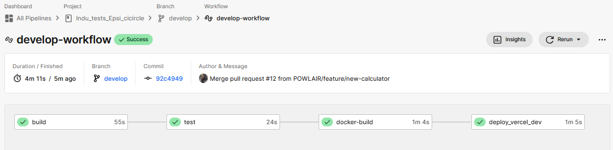

# 📚 Documentation Technique - Configuration CircleCI

<div align="center">
  
</div>

## 📑 Plan du projet

<div align="center">
  <table>
    <tr>
      <th>Section</th>
      <th>Description</th>
    </tr>
    <tr>
      <td><a href="#introduction">📌 Introduction</a></td>
      <td>Présentation générale du projet et de CircleCI</td>
    </tr>
    <tr>
      <td><a href="#documentation-des-outils">🛠️ Documentation des outils</a></td>
      <td>Références aux outils utilisés (Vercel, Docker, CircleCI, GitHub)</td>
    </tr>
    <tr>
      <td><a href="#structure-du-workflow">🔄 Structure du Workflow</a></td>
      <td>Explication des différents workflows du projet</td>
    </tr>
    <tr>
      <td><a href="#workflows">⚙️ Workflows</a></td>
      <td>Explication des différents workflows du projet</td>
    </tr>
    <tr>
      <td><a href="#details-du-fichier-de-configuration-circleci">📝 Details du fichier de configuration CircleCI</a></td>
      <td>Détails sur le fichier `.circleci/config.yml</td>
    </tr>
    <tr>
      <td><a href="#executors">🤖 Executors</a></td>
      <td>Explication des exécuteurs utilisés dans CircleCI</td>
    </tr>
    <tr>
      <td><a href="#description-des-jobs">🔍 Description des Jobs</a></td>
      <td>Détails des différents jobs exécutés</td>
    </tr>
    <tr>
      <td><a href="#job-build">🔨 Job `build`</a></td>
      <td>Installation des dépendances et build du projet</td>
    </tr>
    <tr>
      <td><a href="#job-test">🧪 Job `test`</a></td>
      <td>Exécution des tests unitaires et d'intégration</td>
    </tr>
    <tr>
      <td><a href="#job-docker-build">🐳 Job `docker-build`</a></td>
      <td>Construction et poussée d'une image Docker</td>
    </tr>
    <tr>
      <td><a href="#job-deploy_production">🚀 Job `deploy_production`</a></td>
      <td>Déploiement en production avec Docker et Vercel</td>
    </tr>
    <tr>
      <td><a href="#job-deploy_vercel">🚀 Job `deploy_vercel`</a></td>
      <td>Déploiement de l'application sur Vercel</td>
    </tr>
  </table>
</div>

## Documentation des outils

<div align="center">
  <table>
    <tr>
      <td align="center" width="25%">
        
        <br />
        <strong>Vercel</strong>
        <br />
        Plateforme de déploiement pour applications web modernes avec CI/CD automatisé
        <br />
        <a href="https://indu-tests-epsi-cicircle.vercel.app/">🔗 Voir le projet</a>
      </td>
      <td align="center" width="25%">
        
        <br />
        <strong>CircleCI</strong>
        <br />
        Outil d'intégration et de déploiement continu (CI/CD)
        <br />
        <a href="https://github.com/POWLAIR/Indu_tests_Epsi_cicircle">🔗 Voir sur GitHub</a>
      </td>
    </tr>
    <tr>
      <td align="center" width="25%">
        
        <br />
        <strong>Docker Hub</strong>
        <br />
        Registre public pour stocker et distribuer des images Docker
        <br />
        <a href="https://hub.docker.com/repository/docker/powlker/circleci/general">🔗 Voir l'image Docker</a>
      </td>
      <td align="center" width="25%">
        
        <br />
        <strong>GitHub</strong>
        <br />
        Plateforme de gestion de code source basée sur Git
        <br />
        <a href="https://github.com/POWLAIR/Indu_tests_Epsi_cicircle">🔗 Voir le repository</a>
      </td>
    </tr>
  </table>
</div>

## 📝 Introduction

<div align="center">
  
</div>

Cette documentation décrit en détail le fichier de configuration **CircleCI** utilisé pour automatiser les tests, la construction, l'intégration continue et le déploiement de l'application.

## 🔄 Structure du Workflow

<div class="workflow-overview">
  <h3 align="center">Vue d'ensemble des Workflows de Déploiement</h3>
  <p align="center">Notre pipeline CI/CD est organisé en 4 workflows distincts, chacun adapté à une phase spécifique du développement.</p>
</div>

<div class="workflow-container" align="center">
  <div class="workflow-box feature">
    <div class="workflow-icon">🔨</div>
    <h3>Feature</h3>
    <div class="workflow-description">
      <p><strong>Branches:</strong> feature/*</p>
      <p><strong>Objectif:</strong> Validation rapide du code</p>
      <ul class="workflow-steps">
        <li>✅ Tests automatisés</li>
        <li>🔍 Vérification du code</li>
      </ul>
    </div>
  </div>

  <div class="workflow-box develop">
    <div class="workflow-icon">🚀</div>
    <h3>Develop</h3>
    <div class="workflow-description">
      <p><strong>Branche:</strong> develop</p>
      <p><strong>Objectif:</strong> Intégration continue</p>
      <ul class="workflow-steps">
        <li>📦 Build du projet</li>
        <li>🧪 Tests complets</li>
        <li>🐳 Construction Docker</li>
        <li>🌐 Déploiement Vercel (dev)</li>
      </ul>
    </div>
  </div>

  <div class="workflow-box integration">
    <div class="workflow-icon">🔄</div>
    <h3>Integration</h3>
    <div class="workflow-description">
      <p><strong>Branche:</strong> integration</p>
      <p><strong>Objectif:</strong> Validation pré-production</p>
      <ul class="workflow-steps">
        <li>📦 Build du projet</li>
        <li>🧪 Tests complets</li>
        <li>🐳 Construction Docker</li>
        <li>🌐 Déploiement Vercel (preprod)</li>
      </ul>
    </div>
  </div>

  <div class="workflow-box production">
    <div class="workflow-icon">✨</div>
    <h3>Production</h3>
    <div class="workflow-description">
      <p><strong>Branche:</strong> main</p>
      <p><strong>Objectif:</strong> Déploiement production</p>
      <ul class="workflow-steps">
        <li>📦 Build du projet</li>
        <li>🧪 Tests complets</li>
        <li>🐳 Construction Docker</li>
        <li>⭐ Push Docker latest</li>
        <li>🚀 Déploiement production</li>
      </ul>
    </div>
  </div>
</div>

<style>
/* Dark mode styles */
body {
  background-color: #0d1117;
  color: #c9d1d9;
}

table {
  background-color: #161b22;
  border-color: #30363d;
}

th, td {
  border-color: #30363d;
  color: #c9d1d9;
}

a {
  color: #58a6ff;
}

.workflow-overview {
  background: #161b22;
  border-color: #30363d;
  color: #c9d1d9;
}

.workflow-container {
  display: grid;
  grid-template-columns: repeat(auto-fit, minmax(250px, 1fr));
  gap: 25px;
  margin: 30px 0;
  padding: 0 15px;
}

.workflow-box {
  border: 2px solid #30363d;
  border-radius: 12px;
  padding: 20px;
  background: #0d1117;
  box-shadow: 0 4px 6px rgba(0,0,0,0.3);
  transition: transform 0.2s;
}

.workflow-box:hover {
  transform: translateY(-5px);
  box-shadow: 0 6px 8px rgba(0,0,0,0.4);
}

.workflow-icon {
  font-size: 2em;
  margin-bottom: 10px;
}

.workflow-box h3 {
  margin: 10px 0;
  color: #c9d1d9;
  border-bottom: 2px solid #30363d;
  padding-bottom: 8px;
}

.workflow-description {
  text-align: left;
}

.workflow-description p {
  margin: 8px 0;
  color: #8b949e;
}

.workflow-steps {
  list-style: none;
  padding: 0;
  margin: 10px 0;
  text-align: left;
}

.workflow-steps li {
  margin: 5px 0;
  padding: 5px 10px;
  background: #161b22;
  border-radius: 4px;
  font-size: 0.9em;
  color: #c9d1d9;
}

/* Workflow box border colors */
.feature { border-color: #238636; }
.develop { border-color: #1f6feb; }
.integration { border-color: #8957e5; }
.production { border-color: #f85149; }

/* Image adjustments */
img {
  filter: brightness(0.9) contrast(1.1);
  border-radius: 8px;
  border: 1px solid #30363d;
}

/* Code blocks */
code {
  background: #161b22;
  color: #c9d1d9;
  padding: 2px 6px;
  border-radius: 3px;
  font-size: 85%;
}

/* Tool cards */
.tool-card {
  background: #161b22;
  border: 1px solid #30363d;
  border-radius: 8px;
  padding: 15px;
  margin: 10px;
}

.tool-card img {
  background: #fff;
  padding: 10px;
  border-radius: 8px;
  margin-bottom: 10px;
}

/* Section headers */
h1, h2, h3, h4, h5 {
  color: #c9d1d9;
}

/* Links */
a:hover {
  color: #79c0ff;
  text-decoration: none;
}

/* Badges */
.file-badge {
  background: #1f6feb;
  color: #c9d1d9;
}

/* Tables */
table tr:nth-child(2n) {
  background-color: #161b22;
}

/* Images for the documentation */
.doc-image {
  max-width: 100%;
  height: auto;
  margin: 20px 0;
  background: #161b22;
  padding: 10px;
  border-radius: 8px;
  box-shadow: 0 4px 6px rgba(0,0,0,0.2);
}

/* Adjust specific images */
img[src*="circleci.com"] {
  background: #fff;
  padding: 15px;
}

img[src*="workflow.png"] {
  background: #161b22;
  padding: 10px;
  margin: 15px 0;
}

</style>

## Workflows

<div class="workflow-details">
  <div class="workflow-detail-section feature">
    <h3>🔨 Feature Workflow</h3>
    <div class="workflow-content">
      <div class="workflow-info">
        <div class="workflow-description">
          <p>Exécute uniquement les tests sur les branches <code>feature/*</code></p>
          <div class="workflow-steps">
            <h4>Étapes :</h4>
            <ul>
              <li>✅ Vérification du code</li>
              <li>🧪 Exécution des tests</li>
              <li>📊 Génération des rapports</li>
            </ul>
          </div>
        </div>
      </div>
      <div class="workflow-image">
        
      </div>
    </div>
  </div>

  <div class="workflow-detail-section develop">
    <h3>🚀 Develop Workflow</h3>
    <div class="workflow-content">
      <div class="workflow-info">
        <div class="workflow-description">
          <p>Pipeline de développement continu sur la branche <code>develop</code></p>
          <div class="workflow-steps">
            <h4>Étapes :</h4>
            <ul>
              <li>📦 Build du projet</li>
              <li>🧪 Exécution des tests</li>
              <li>🐳 Construction Docker</li>
              <li>🌐 Déploiement Vercel (dev)</li>
            </ul>
          </div>
        </div>
      </div>
      <div class="workflow-image">
        
      </div>
    </div>
  </div>

  <div class="workflow-detail-section integration">
    <h3>🔄 Integration Workflow</h3>
    <div class="workflow-content">
      <div class="workflow-info">
        <div class="workflow-description">
          <p>Pipeline de pré-production sur la branche <code>integration</code></p>
          <div class="workflow-steps">
            <h4>Étapes :</h4>
            <ul>
              <li>📦 Build du projet</li>
              <li>🧪 Tests complets</li>
              <li>🐳 Construction Docker</li>
              <li>🌐 Déploiement Vercel (preprod)</li>
            </ul>
          </div>
        </div>
      </div>
      <div class="workflow-image">
        
      </div>
    </div>
  </div>

  <div class="workflow-detail-section production">
    <h3>✨ Production Workflow</h3>
    <div class="workflow-content">
      <div class="workflow-info">
        <div class="workflow-description">
          <p>Pipeline de production sur la branche <code>main</code></p>
          <div class="workflow-steps">
            <h4>Étapes :</h4>
            <ul>
              <li>📦 Build du projet</li>
              <li>🧪 Tests complets</li>
              <li>🐳 Construction Docker</li>
              <li>⭐ Push Docker latest</li>
              <li>🚀 Déploiement production</li>
            </ul>
          </div>
        </div>
      </div>
      <div class="workflow-image">
        
      </div>
    </div>
  </div>
</div>

<div class="version-deployment">
  <h3>📊 Version Deployement par environnement</h3>
  
</div>

<style>
/* Existing styles ... */

.workflow-details {
  display: flex;
  flex-direction: column;
  gap: 30px;
  margin: 20px 0;
}

.workflow-detail-section {
  background: #161b22;
  border-radius: 12px;
  padding: 20px;
  border: 2px solid #30363d;
}

.workflow-content {
  display: flex;
  gap: 20px;
  margin-top: 15px;
  align-items: flex-start;
}

.workflow-info {
  flex: 1;
  min-width: 300px;
}

.workflow-image {
  flex: 2;
}

.workflow-diagram {
  width: 100%;
  height: auto;
  border-radius: 8px;
  border: 1px solid #30363d;
  background: #0d1117;
  padding: 10px;
}

.workflow-steps {
  background: #0d1117;
  border-radius: 8px;
  padding: 15px;
  margin-top: 15px;
}

.workflow-steps h4 {
  margin: 0 0 10px 0;
  color: #c9d1d9;
}

.workflow-steps ul {
  list-style: none;
  padding: 0;
  margin: 0;
}

.workflow-steps li {
  margin: 8px 0;
  padding: 8px 12px;
  background: #161b22;
  border-radius: 6px;
  color: #c9d1d9;
}

.version-deployment {
  margin-top: 30px;
  background: #161b22;
  border-radius: 12px;
  padding: 20px;
  border: 2px solid #30363d;
}

.full-width {
  width: 100%;
  max-width: 100%;
}

/* Workflow section specific colors */
.workflow-detail-section.feature { border-color: #238636; }
.workflow-detail-section.develop { border-color: #1f6feb; }
.workflow-detail-section.integration { border-color: #8957e5; }
.workflow-detail-section.production { border-color: #f85149; }

@media (max-width: 768px) {
  .workflow-content {
    flex-direction: column;
  }
  
  .workflow-info, .workflow-image {
    width: 100%;
  }
}
</style>

## Details du fichier de configuration CircleCI

### Fichier de Configuration - `.circleci/config.yml`

```yaml
version: 2.1

orbs:
  node: circleci/node@5
  docker: circleci/docker@2

executors:
  node-executor:
    docker:
      - image: node:18-bullseye
    working_directory: ~/project
```

#### Executors
L'exécuteur `node-executor` utilise l'image **Node.js 18-bullseye** et définit le répertoire de travail du projet.

### Description des Jobs

#### Job `build`

Ce job est responsable de l'installation des dépendances, du linting et de la compilation du projet.

```yaml
  build:
    executor: node-executor
    steps:
      - checkout
      - restore_cache:
          keys:
            - v1-dependencies-{{ checksum "package-lock.json" }}
      - run:
          name: "Install dependencies"
          command: npm install
      - save_cache:
          paths:
            - node_modules
          key: v1-dependencies-{{ checksum "package-lock.json" }}
      - run:
          name: "Linting code"
          command: npm run lint
      - run:
          name: "Build project"
          command: npm run build
      - persist_to_workspace:
          root: .
          paths:
            - node_modules
            - .next
            - public
```

Explication :
- Récupère le code source (`checkout`).
- Restaure les dépendances depuis le cache si possible (`restore_cache`).
- Installe les dépendances (`npm install`).
- Sauvegarde le cache (`save_cache`).
- Vérifie la qualité du code (`npm run lint`).
- Compile le projet (`npm run build`).
- Sauvegarde les fichiers générés pour les étapes suivantes (`persist_to_workspace`).


### Job `test`

Ce job exécute les tests unitaires et d'intégration du projet.

```yaml
  test:
    executor: node-executor
    steps:
      - checkout
      - restore_cache:
          keys:
            - v1-dependencies-{{ checksum "package-lock.json" }}
      - attach_workspace:
          at: ~/project
      - run:
          name: "Run tests"
          command: npm run test:ci
```

Explication :
- Récupère le code source (`checkout`).
- Restaure les dépendances (`restore_cache`).
- Attache l'espace de travail contenant les dépendances (`attach_workspace`).
- Exécute les tests (`npm run test:ci`).


### Job `docker-build`

Construit et pousse une image Docker du projet.

```yaml
  docker-build:
    docker:
      - image: docker:stable
    steps:
      - checkout
      - setup_remote_docker:
          docker_layer_caching: true
      - attach_workspace:
          at: ~/project
      - run:
          name: "Build and tag Docker image"
          command: |
            docker build --cache-from powlker/circleci:latest -t powlker/circleci:$CIRCLE_SHA1 .
      - run:
          name: "Login to Docker Hub"
          command: |
            echo "$DOCKER_PASSWORD" | docker login -u "$DOCKER_USERNAME" --password-stdin
      - run:
          name: "Push Docker image"
          command: |
            docker push powlker/circleci:$CIRCLE_SHA1
```

Explication :
- Récupère le code source (`checkout`).
- Attache l'espace de travail contenant les fichiers nécessaires (`attach_workspace`).
- Installe l'outil de déploiement Vercel CLI (`npm install -g vercel`).
- Déploie l'application sur Vercel en utilisant le token d'authentification et le scope correspondant.


### Job `deploy_vercel`

Ce job assure le déploiement de l'application sur **Vercel** pour les environnements de développement et d'intégration.

```yaml
  deploy_vercel:
    executor: node-executor
    parameters:
      vercel_scope:
        type: string
    steps:
      - checkout
      - attach_workspace:
          at: ~/project
      - run:
          name: "Install Vercel CLI"
          command: npm install -g vercel
      - run:
          name: "Deploy to Vercel"
          command: |
            vercel --token $VERCEL_TOKEN --prod --scope << parameters.vercel_scope >>
```
Explication :
- Récupère le code source (`checkout`).
- Attache l'espace de travail contenant les fichiers nécessaires (`attach_workspace`).
- Installe l'outil de déploiement Vercel CLI (`npm install -g vercel`).
- Déploie l'application sur Vercel en utilisant le token d'authentification et le scope correspondant.


### Job `deploy_production`

Ce job assure le déploiement en production en utilisant une image **Node.js 18** avec support des navigateurs, l'installation de Docker CLI, l'installation de Vercel CLI, la gestion des images Docker et le déploiement final sur **Vercel**.

```yaml
  deploy_production:
    docker:
      - image: cimg/node:18.19-browsers  
    steps:
      - checkout
      - setup_remote_docker:
          docker_layer_caching: true
      - run:
          name: "Install Docker CLI"
          command: |
            curl -fsSL https://get.docker.com -o get-docker.sh
            sudo sh get-docker.sh
      - run:
          name: "Install Vercel CLI"
          command: sudo npm install -g vercel
      - run:
          name: "Login to Docker Hub"
          command: |
            echo "$DOCKER_PASSWORD" | docker login -u "$DOCKER_USERNAME" --password-stdin
      - run:
          name: "Push Docker image as latest"
          command: |
            docker pull powlker/circleci:$CIRCLE_SHA1
            docker tag powlker/circleci:$CIRCLE_SHA1 powlker/circleci:latest
            docker push powlker/circleci:latest
      - run:
          name: "Deploy to production"
          command: |
            vercel --token $VERCEL_TOKEN --prod
            echo "Production deployed"
```

### Explication des étapes
- **Utilisation de l'image `cimg/node:18.19-browsers`** : Fournit un environnement avec Node.js 18 et support des navigateurs.
- **Installation de Docker CLI** : Télécharge et installe Docker CLI pour exécuter les commandes Docker dans l'environnement CircleCI.
- **Installation de Vercel CLI** : Installe l'outil CLI de Vercel pour gérer les déploiements.
- **Authentification sur Docker Hub** : Nécessaire pour pousser les images Docker.
- **Mise à jour et push de l'image Docker** : Télécharge l'image Docker existante, la tague en `latest` et la pousse sur Docker Hub.
- **Déploiement sur Vercel** : Effectue le déploiement final de l'application en production.


